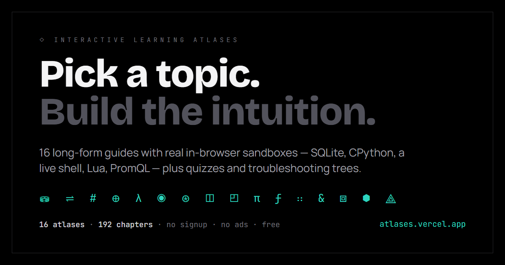

# Atlases

**[atlases.vercel.app](https://atlases.vercel.app/)** — 16 long-form interactive learning guides. Pick a topic, build the intuition.



Each atlas is a 12-chapter deep dive with **real in-browser sandboxes**, curated snippet libraries, interactive troubleshooting trees, and per-chapter quizzes. No signup, no ads, no tracking — progress saves to localStorage.

## The atlases

| | | | |
|---|---|---|---|
| ⛁ Databases | ⇌ Networking | # Linux | ⊕ Cryptography |
| λ Compilers | ◉ Observability | ⊛ AI/LLM Engineering | ◫ FiveM / Lua / QBCore |
| ◰ Encoding & Wire Formats | π Python | ƒ JavaScript | ∷ C++ |
| & C | ⧈ Docker | ⬢ n8n | ⟁ Coolify |

## What's inside each atlas

- **12 chapters** — origin → toolchain → bedrock → working library → triage → roadmap
- **Real sandboxes** — SQLite (sql.js), CPython (Pyodide), C/C++ (JSCPP), a JS REPL, a working mini-shell, a Lua interpreter, a live PromQL playground — all running in your browser, nothing server-side
- **Curated libraries** — production-grade snippets organized by intent
- **Troubleshooting trees** — walk symptom → diagnosis → fix interactively
- **Quizzes** — every chapter, with explanations
- **Stack profiles** — pick your context and examples adapt throughout

## How it was made

The content was drafted with AI (Claude), then human-curated and fact-checked — claims are dated, fast-moving facts carry a "current as of" stamp, and sources are cited per atlas. If you spot an error, [open an issue](../../issues).

## Run locally

```bash
npm install
npm run dev
```

Build with `npm run build` (output in `dist/`). Deploys anywhere that serves static files; `vercel.json` handles the SPA rewrites for Vercel.

## Project layout

```
src/
  main.jsx              React root; loads storage shim first
  App.jsx               Routes (one per atlas, code-split)
  pages/Landing.jsx     Landing page listing all atlases
  atlases/              One self-contained .jsx per atlas
  lib/storage-shim.js   localStorage-backed window.storage API
og-source.html          Social preview card source (1200x630)
og-shot.py              Renders og-source.html -> public/og.png (Playwright)
```

## Adding a new atlas

1. Drop the new `*.jsx` file in `src/atlases/`
2. Add the lazy import + route in `src/App.jsx`
3. Add a card in `src/pages/Landing.jsx`

## License

MIT
